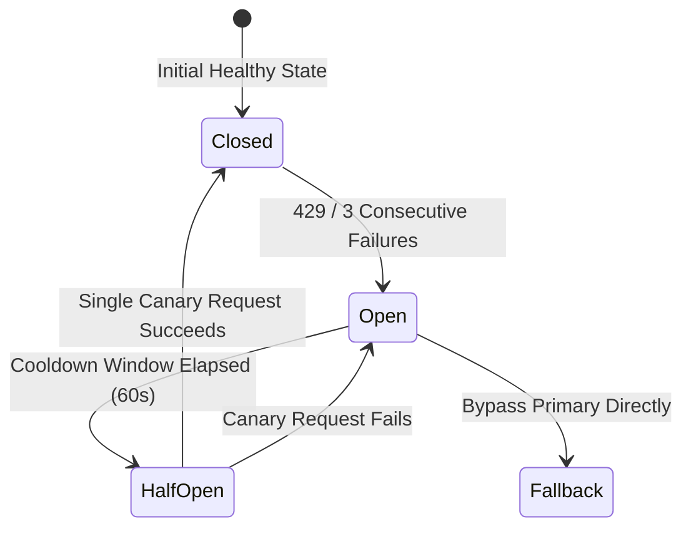

# Design: Anti-Thundering-Herd LLM Fallback, Universal Webhooks, and 2md Scraper

## Context

The backend calls language models via `chatJson` in `packages/backend/src/providers/llm.ts`. Currently, calls use a single model spec without retry across providers. A naive fallback chain would create a dangerous **Thundering Herd Problem (驚群效應)**: when the primary LLM goes down (e.g. rate-limited 429), dozens of concurrent worker jobs fail simultaneously and stampede onto `fallback_1`, instantly exhausting its rate limits and cascading down to knock out `fallback_2`.

In addition, notification delivery in `packages/backend/src/notify/` is built specifically around Feishu API structures, and dynamic rendering currently relies on commercial Jina tokens.

See `proposal.md` for full motivation.

## Goals / Non-Goals

**Goals:**
- Provide native provider configurations and presets for **Groq**, **Google Gemini**, and **OpenAI**, alongside custom OpenAI-compatible base URLs.
- Prevent the **Thundering Herd Problem** via:
  1. **Circuit Breaker per Provider** (`CLOSED`, `OPEN`, `HALF-OPEN`)
  2. **Canary Probing** on recovery
  3. **Concurrency Limiting** per fallback tier
  4. **Exponential Backoff with Full Jitter**
- Proactively notify administrators via operational alerts whenever a fallback model is activated.
- Provide clean, decoupled webhook adapters for **Slack**, **Discord**, and **Telegram**.
- Support `https://2md.aiurl.tw` (`888-url2md`) as the primary dynamic anti-scraping reader.

**Non-Goals:**
- Removing the existing receipt/budget tracking system (`receipts.ts`) — all fallback calls still record receipts and respect budget safeguards.
- Building bidirectional bot command parsers for Slack/Discord; outbound webhooks and Telegram `sendMessage` fulfill all alerting and broadcasting needs.

## Decisions

### 1. Anti-Thundering-Herd Architecture for LLM Fallback

- **Decision 1: Circuit Breaker per Provider**:
  - Each model tier (`primary`, `fallback_1`, `fallback_2`) maintains an in-memory circuit state:
    - `CLOSED`: Normal operations.
    - `OPEN`: Tripped by HTTP 429 (immediate trip) or 3 consecutive 5xx/timeout failures.
      - **When OPEN**: Incoming requests do NOT touch the tripped provider at all. They bypass directly to the next healthy fallback tier, eliminating wasted timeout latency and avoiding hammering the failed service.
      - Default cooldown window: 60 seconds (or parsed `Retry-After` header).
    - `HALF-OPEN`: When cooldown expires, **only 1 single canary request** is allowed through to test the primary service. All other concurrent requests continue routing to fallback until the canary confirms recovery. If the canary succeeds, the circuit closes; if it fails, the circuit re-opens for another cooldown.
- **Decision 2: Concurrency Limiting per Fallback Tier**:
  - Fallback models (especially free/cheap tiers on Groq or Gemini) often have lower RPM/TPM rate limits than enterprise primary models.
  - Implement an in-flight semaphore capping maximum concurrent requests to any fallback provider (e.g., max 3 concurrent calls). Surplus requests wait in an asynchronous queue rather than flooding the API.
- **Decision 3: Exponential Backoff with Full Jitter**:
  - Introduce randomized jitter delay before retrying or switching tiers:
    $$\text{delay} = \text{random}(0, \min(\text{maxBackoff}, \text{baseBackoff} \times 2^{\text{attempt}}))$$
  - Prevents worker tasks from pulsing in synchronized waves.
- **Decision 4: Alerting on Fallback Activation**:
  - When a primary request trips and engages fallback, trigger `dispatchAlert` with finding key `llm.fallback_active`, detailing the tripped provider, error reason, and fallback model chosen.

### 2. Provider Presets & Groq / Gemini / OpenAI Standardization
- Add presets:
  - `groq`: `https://api.groq.com/openai/v1` (models: `llama-3.3-70b-versatile`, `deepseek-r1-distill-llama-70b`)
  - `gemini`: `https://generativelanguage.googleapis.com/v1beta/openai/` (models: `gemini-2.5-flash`, `gemini-2.5-pro`)
  - `openai`: `https://api.openai.com/v1` (models: `gpt-4o-mini`, `gpt-4o`)
- Fallback configurations read:
  - `LLM_FALLBACK_1_MODEL`, `LLM_FALLBACK_1_BASE_URL`, `LLM_FALLBACK_1_API_KEY`
  - `LLM_FALLBACK_2_MODEL`, `LLM_FALLBACK_2_BASE_URL`, `LLM_FALLBACK_2_API_KEY`

### 3. Unified Notification Dispatcher (`notify/dispatch.ts`)
- Interface `dispatchNotification(event)` abstracts over:
  - `slack.ts`: POST to `SLACK_WEBHOOK_URL` with Block Kit payload.
  - `discord.ts`: POST to `DISCORD_WEBHOOK_URL` with Discord Embed payload.
  - `telegram.ts`: POST to `https://api.telegram.org/bot<TOKEN>/sendMessage` with HTML/Markdown payload.
  - `feishu.ts`: Retain as an optional legacy channel.
- Channels are dispatched concurrently (`Promise.allSettled`), ensuring a failure in one webhook cannot slow down or drop deliveries to other channels.

### 4. Dynamic Scraper Integration (`2md.aiurl.tw`)
- Generalize `packages/backend/src/providers/jina.ts` into a universal `reader.ts` engine.
- Configurable via `READER_BASE_URL`, defaulting to `https://2md.aiurl.tw`.
- Sends `GET ${READER_BASE_URL}/${targetUrl}` with `Accept: text/plain` (or `application/json`), parsing clean Markdown with zero token cost.

## Risks / Trade-offs

- **[Risk] State Loss Across Worker Restarts**: In-memory circuit breaker state resets if worker process restarts.
  - *Mitigation*: Resetting to `CLOSED` upon restart is safe and standard; if the provider is still down, the first 1-3 requests will re-trip the circuit immediately without harm.
- **[Risk] Fallback Concurrency Bottleneck**: If fallback concurrency is capped at 3, high-volume batch processing might slow down during a primary outage.
  - *Mitigation*: This is desirable graceful degradation—preserving service availability and preventing 429 cascading failures is far better than crashing the worker pipeline.

## Migration Plan

1. The changes are strictly backward compatible: if no fallback or webhook env vars are set, the application operates normally with the existing single LLM.
2. Admins can incrementally configure Slack, Discord, Telegram, and 2md scraper in `.env`.
